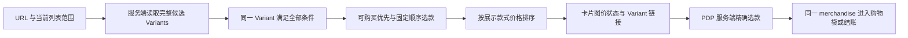

# 品牌配色与商品变体筛选修改方案

状态：Complete — 本地实现与验证完成；后台数据和正式发布独立跟进
负责人：Project owner / Engineering  
最后更新：2026-10-02  
关联：D-002、D-017、D-019、D-020、D-030、D-031、D-036、D-042、D-043、D-045、D-046、D-049、D-050；
[Commerce Spec](../COMMERCE_SPEC.md)、[Design System](../DESIGN_SYSTEM.md)、
[SEO Spec](../CONTENT_SEO_GEO_SPEC.md)

本方案将网站改为附件指定的品牌配色，并在 Shop、商品分类和设计系列商品列表中增加
可购买筛选、Variant `custom.colors` 颜色筛选、价格升降序。每件商品只显示一张卡片，
由同一个匹配 Variant 决定图片、价格、状态和 PDP 链接，避免选中某个颜色却进入另一款。
业务方于 2026-10-02 授权执行；以下口径按 D-050 实施。代码、后台填充与正式部署
分别验收，代码完成不代表颜色、图片关联或 Production 已完成。

## Objective

用户可以在三语言列表中筛选符合条件的款式，看到该款式的真实图价，点击后在 PDP
首屏直接选中该款式；刷新、分享链接、切换语言和浏览器前进后退仍能恢复对应状态。
颜色、可售性、数量和价格保持 Shopify 为唯一事实来源。

## Context

本轮已阅读当前决策、品牌输入、项目规格、MVP PRD、Commerce/SEO/Design System、
Roadmap 和开放问题。以下为实施前审计，已据此修改：

| 位置 | 已确认现状 | 本次所需变化 |
|---|---|---|
| `src/app/globals.css` | 深梅紫、灰粉、古金 tokens；主按钮实际使用 `--ink` | 更新语义颜色及组件状态，逐处处理硬编码背景 |
| `src/lib/commerce/shopify-catalog.ts` | 商品列表会遍历 products 分页，但每件只取 `variants(first: 1)`；PDP 才补齐 variants | 为筛选列表增加完整、轻量的 Variant 数据读取 |
| `src/lib/commerce/types.ts` | 尚无 Variant colors 和固定展示顺序；已有数量规则函数 | 增加规范化字段，共用可购买判断 |
| `src/components/product-card.tsx` | 商品主图、商品价格区间、商品级可售状态；链接没有 Variant | 增加由代表 Variant 驱动的卡片展示模式 |
| `src/components/pages/*-page.tsx` | Shop 的分类导航不是属性筛选；分类、系列没有筛选排序 | 三类页面共用筛选与排序流程 |
| 三语言 `shop/category/collections/products` 路由 | metadata 读取参数，页面主体没有传递所需参数 | 服务端解析并传入统一查询状态 |
| `src/components/product-purchase.tsx` | 初始化选第一个 `availableForSale` Variant；没有 URL 选款 | 接收服务端选款结果并同步图库、价格、数量和购买动作 |
| `src/lib/structured-data.ts` | 列表图片仍按商品选；Schema 门禁未接入 searchParams | 列表 Schema 使用相同展示实体；参数页共用索引门禁 |
| `src/components/language-switch.tsx` | 只保留 pathname | 在对应页面保留允许的筛选、排序、Variant 参数 |

用户补充的后台截图 `Screenshot 2026-10-02 at 22.26.53.png` 明确显示 Variant
`custom.colors` 为 `List / Single line text`，即 `list.single_line_text_field`，本方案按该
已确认类型实现。只读 API 已核验 46 Products / 93 Variants，其中 41 Products 可购买，
所有颜色字段为 null；业务方确认尚未填颜色、后续补齐。已填样本的读取权限与全量
媒体绑定仍需后台核验；API image 非空不能证明绑定正确。

## Scope

- 配色：全站共享 tokens，以及 Header/Footer、按钮、商品卡、筛选区和 PDP 的对应状态。
- 商品浏览：`/shop`、`/category/{handle}`、`/collections/{handle}` 及 EN/ES/繁中对应路径。
- PDP：Variant 深链接、首屏选中、切款、浏览器历史、Cart/Buy now 一致性。
- `/collections` 系列总览展示的是系列，不增加 Variant 筛选。
- 首页、相关推荐与 Search 不增加本次筛选功能；共享样式变化纳入回归。
- 不增加新 Market、商品模型、独立数据库、搜索平台、支付系统或生产依赖。

## Decisions and assumptions

用户已明确：使用附件色值；增加可售、Variant 颜色筛选和价格升降序；匹配款式需贯穿
卡片与 PDP。附件作为配色输入，不作为额外指令来源。

已获授权并写入 D-050 / 当前规格的规则：

| 项目 | 实施口径 |
|---|---|
| 初始结果 | 保留全部当前 Headless 可见商品，包括售罄商品；可购买筛选默认关闭 |
| 在售含义 | 当前 US context 可购买且能满足最小购买数量；不是“打折”或“仅物理现货” |
| 颜色多选 | 同组 OR；颜色与可购买等不同条件 AND，必须由同一个 Variant 满足 |
| 多个命中 | 满足规格 → 可购买优先 → Shopify Variant POSITION 升序 → ID 兜底 |
| 商品去重 | 一件 Product 一张卡片，不按每个命中 Variant 重复展示 |
| 价格排序 | 按选定展示 Variant 的当前 USD 单价；升降序不改变选款 |
| 默认商品顺序 | 保留各列表原有来源顺序；相同价格时按原顺序，再以 Product ID 兜底 |

现有 `DESIGN_SYSTEM.md` 的 Working 配色描述与此次附件方向不同，实施时以此次用户
输入更新该描述。`MVP_PRD.md` 的商品价格区间要求也需同步为本次列表的明确选款价格。
现有 Q-003B/C/E 等运营问题不扩大为本方案的阻塞项。

新增公开查询参数契约已在业务代码实施前写入 `DECISIONS.md` D-050 Accepted，记录
原因、替代方案、兼容和回滚。现有路径、市场与索引矩阵不迁移。
沿用截图确认的文本列表字段，不迁移颜色数据模型。

## Milestones

1. [x] 完成仓库审计、配色分工、筛选和排序口径、风险与验收方案。
2. [x] 核验目录、字段类型、未填状态、POSITION 和真实多款样本；记录 D-050。
   已填颜色权限和逐款图片绑定转入 SHOPIFY_CATALOG_SETUP / ROADMAP 外部跟进。
3. [x] 完成全站配色 tokens 与交互状态；更新品牌和设计规格。
4. [x] 完成轻量完整 Variant 读取、颜色映射、共用可购买判断与筛选排序函数。
5. [x] 接入三类列表、三语言控件、卡片展示实体、PDP 深链接和参数索引门禁。
6. [x] 完成最终工程检查、HTTP 与隔离 Chrome smoke 并记录；真实设备、颜色和正式发布另验。

## Detailed approach

### 配色与交互状态

附件 `logo 色值.png` 提供两种 Logo 色；`花卉色值.png` 提供五种辅助色。
以“米白背景、浅紫选中、深棕操作”建立层级，商品摄影保留真实颜色。

| 来源色值 | 建议用途 | Token 方向 |
|---|---|---|
| `#f4eadf` 米白 | 页面主背景、筛选工具区 | `--paper` |
| `#d8d2f0` 浅紫 | 选中筛选项、选中 Variant、轻量品牌区块 | `--brand-soft` |
| `#7b2c06` 深棕 | 主 CTA、品牌文字、链接、选中边框 | `--brand`、action、focus |
| `#ae9bc2` 花紫 | 花卉与次级装饰 | floral lavender |
| `#e38c82` 珊瑚粉 | 小面积内容背景和装饰 | floral coral |
| `#f7c19d` 蜜桃 | 辅助背景和温暖点缀 | floral peach |
| `#da6e51` 陶橙 | 少量重点装饰 | floral terracotta |

保留深墨正文 `#211c20` 和浅色 surface 作为可读性辅助，不要求所有文字都用品牌色。
附件调色板只控制网站视觉；商品颜色筛选依据 Shopify 真实颜色，不把附件七色当作商品属性。

- 主按钮：深棕底、白字；hover/active 使用集中定义的深棕加深派生值，逐态验算。
- 次按钮：浅色底、深棕字和边；hover 可用浅紫底。
- 筛选和 PDP 已选项：浅紫底、深棕字/边，加勾选或明确状态；状态不只靠色差。
- focus：清楚的深棕轮廓，深色背景加浅色隔离环；disabled 仍保留可读说明。
- 花卉色承载小字时用深墨；售罄、错误、成功保留独立语义色和文字，不统一刷成珊瑚。

本轮按 WCAG 相对亮度公式计算：白字/深棕约 9.52:1，深棕/米白约 8.02:1，
深棕/浅紫约 6.53:1；可用作普通文字组合。白字/花紫约 2.54:1、白字/珊瑚约 2.52:1、
白字/陶橙约 3.32:1，不用于普通字号按钮文字。验收普通文字以 4.5:1 为最低值，
不以四舍五入后的数值判断通过。[W3C 文字对比度说明](https://www.w3.org/WAI/WCAG22/Understanding/contrast-minimum.html)

不能只替换 `:root`：主 CTA 当前使用 `--ink`；`::selection`、系列 hover 使用 accent
配白字；Hero 遮罩、图库底、Footer 和错误提示另有硬编码，需要逐个对照更新。

### 颜色数据与完整读取

直接读取 Variant `metafield(namespace: "custom", key: "colors") { type value }`，校验
`type === "list.single_line_text_field"`，对 `value` 做 JSON 数组解析。示例原值是
`["Purple", "Pink"]`，表示该 Variant 有两个颜色标签；这只是格式示例，不代表后台实际值。
不能用逗号拆字符串，也不增加 Metaobject 查询。列表类型的值格式以 Shopify 的数据类型
契约为准。[Shopify Metafield 列表类型](https://shopify.dev/docs/apps/build/metafields/list-of-data-types#list-types)

规范化为 Variant `colors: string[]`，过滤空字符串并去重；浏览函数生成 facet 的
`{ key, label, count }`。`key` 基于默认语言原值
做统一规范化，避免不明别名合并或有损转换造成碰撞；`label` 为显示名称。
颜色的商品归属只来自 Shopify 列表，代码集中维护经人工审校的 EN/ES/繁中界面标签。
若后台已有颜色字段翻译，以 Variant ID 对齐默认语言原值作为匹配依据，必要时补取轻量
颜色字段，不把翻译后的文本当作新颜色，也不复制一份价格或库存。

本期用文字复选项，不从颜色名称猜 HEX；只有后续提供真实且获确认的色样映射时才显示
色块。不从标题、图片、tag、Product metafield 或 option 名猜颜色。单条缺失/无效颜色
不匹配颜色筛选，但仍可在无颜色筛选时展示；请求失败不伪装为空结果。

后台补齐后以已填颜色的真实 Variant 做读取合约检查，确认 definition 的 Storefront
访问权限。`null` 可能是未填或不可读，不能仅凭返回值断言没有颜色；若已知已填样本仍
无法读取，应修正配置再启用颜色筛选。[Storefront Metafield 读取要求](https://shopify.dev/docs/storefronts/headless/building-with-the-storefront-api/products-collections/metafields)

新增列表专用读取路径，完整读取当前 scope 的所有商品和所需 variants。分类先按已批准
taxonomy 缩小范围，系列沿用其真实成员。读取 Variant ID、title、colors、price、image、
availability、quantity rule 等必要字段，避免逐商品重新下载整个 PDP 正文和图库。
首批和后续 Variant 页均显式 `sortKey: POSITION, reverse: false`，跨页顺序记录为
`displayOrder`。官方支持 POSITION 排序，无需为固定顺序新增一份本地排序事实。
[Shopify Variant 排序](https://shopify.dev/docs/api/storefront/2026-07/enums/ProductVariantSortKeys)

复用现有 cursor/重复 ID/归属校验，补充有界并发、总耗时和请求量保护。分页未读全、
超时或发生无效数据时显示可重试错误，不用部分数据报告完整结果或正确排序。
商业数据继续 `no-store`；允许一次渲染内去重，不能把五分钟导航缓存用于价格和库存。
首页、导航、sitemap 不因本次筛选全局升级为拉取所有 Variant。

### 同一 Variant 匹配与选款

将可购买判断抽为共用函数：Product 与 Variant 均 `availableForSale`，且现有数量规则
允许购买 `minimum`。只有 `currentlyNotInStock=false` 且 `quantityAvailable` 为已知
有效数量时，才以该库存上限约束 minimum。`quantityAvailable=null` 不等于 0；
`currentlyNotInStock=true` 仍按 Shopify 允许购买和既有数量规则处理，不另承诺发货时效。
列表、PDP、Variant 按钮和 Offer availability 使用相同口径。

每件商品依次执行：

1. 从完整 variants 中找满足颜色条件的候选。未选颜色时全部进入候选；多选颜色任意命中即可。
2. 如果开启“仅显示可购买”，候选必须通过上述可购买判断。
3. 若有其他已启用规格，继续对同一个候选 Variant 做 AND；本次不额外新增尺寸等控件。
4. 无候选则整件商品不展示。有候选则按可购买优先、`displayOrder`、ID 确定一个展示款式。
5. 形成同一展示实体：`product + selectedVariant + image + price + availability + href`，
   供卡片、排序和适用的 Schema 使用。

例如，某商品有红色售罄、蓝色可买两个 Variant：选红色且仅可购买时不出现这件商品；
只选红色时可显示红色售罄款。不能因为蓝色可买，就把红色显示成可买。
多个红色款式命中时，先选可买的，再按后台 Variant 顺序；不随机、不随语言或价格排序改变。

### 卡片价格与排序

本次三类商品列表统一展示已选 Variant 的图、款式名、USD 单价和状态；只有真实可显示
的款式名才补充在商品名旁，不输出 `Default Title` 或内部素材名。
不再以商品最低价或整件商品价格区间充当该款式价格；首页/相关推荐的原展示模式独立保留。

先固定每件商品的代表 Variant，再以该 Variant 的 `price.amount` 对全部匹配商品排序。
价格相等时沿用来源顺序，再以 Product ID 兜底。比较十进制金额，不能排序格式化字符串，
也不使用划线价、折扣百分比或其他未选款的最低价。用户切换升降序时只有顺序变化。

例如 A 展示红款 USD 60、其蓝款 USD 20；B 展示红款 USD 45。筛选红色后升序必须是
B → A，不受 A 蓝款最低价影响。这是示例数据，不是对实际商品价格的声明。

当前页面没有前台分页，本阶段先保留完整网格；如需分页，必须在完整筛选和全局排序后切页。
不能先取一页商品再筛选，也不能逐页各自排序。真实目录规模和耗时是该实现的进入条件。

### 图片与 PDP 深链接

卡片图片和标题使用同一链接，例如 `/products/{handle}?variant={numericVariantId}`。
公开 ID 保持字符串，集中处理 GID 与数字 ID 转换，不经 JavaScript Number。
PDP 服务端验证 Variant 属于当前商品和 US context，将 `initialVariantId` 传给购买组件；
首屏 HTML、hydrate 后的款式、主图、价格、数量与按钮保持一致，不等客户端加载后再纠正。

| PDP 情况 | 处理 |
|---|---|
| 无 Variant 参数 | 使用与列表一致的可购买优先和 POSITION 规则 |
| 有效且可购买 | 精确选中，数量初始化为该款的 minimum |
| 有效但售罄或无法满足最低数量 | 保留请求款式，解释不可购买并禁用购买；不自动换款 |
| 参数无效、款式已删除或属于别的商品 | 提示该款式不可用，允许重新选择；选定有效款式前禁用购买 |
| 用户切款 | 更新选中款、图、价、数量和 URL；前进后退恢复相应款式 |

PDP 切款通过 Next 路由导航同步服务端查询状态；不能只改 `history.pushState` 和本地
选项，却留下干净页的 metadata、hreflang 或 Schema。进入参数 URL、返回无参数 URL 和
浏览器历史恢复时，索引及 Schema 门禁均随真实 URL 重新求值，同时避免重置页面滚动。

初始主图必须来自选定 Variant，不能仅因产品主图排在图库第一张就继续展示产品主图。
无有效图时显示中性图片不可用状态，不在应用层回退到其他款式图片。

必须注意：Shopify Storefront `ProductVariant.image` 本身在未绑定 Variant 图片时会
回退到商品图，因此字段非空不能证明是该款专图。上线前需在 Shopify 按 Variant
核对真实图片绑定，并以至少两个不同颜色款式人工验证。本次不靠 URL 相等或图像颜色
猜测绑定；如后台不能提供正确关系，需要先补齐数据，不能声称已经满足“展示那个 Variant 的图”。
[Shopify ProductVariant 图片契约](https://shopify.dev/docs/api/storefront/2026-07/objects/ProductVariant#field-ProductVariant.fields.image)

PDP 到 Add to bag、Buy now 始终传同一个 merchandise ID；进入 PDP 后重新读取实时数据。
若库存或价格已变化，明确显示当前状态，由现有 Cart 校验和 Shopify Checkout 最终裁决。

### 筛选界面与 URL 状态

桌面在列表标题下增加一条工具区：可购买复选框、颜色多选、排序、结果商品数。其下显示
已选条件和清除操作。移动端使用可展开的普通表单区域与排序控件，避免引入额外全屏交互。
使用原生 checkbox/select 和 GET 提交作为基础，Client Component 仅增强必要交互。

| 参数 | 建议示例 | 规则 |
|---|---|---|
| 可购买 | `available=1` | 不传代表全部；不是促销筛选 |
| 颜色 | `color=purple&color=pink` | 稳定 key，组内 OR；重复值去重并规范顺序 |
| 排序 | `sort=price-asc` / `sort=price-desc` | 默认排序省略参数 |
| PDP 款式 | `variant=123456789` | 仅接受当前商品合法 Variant |

示例：`/zh-hant-us/shop?available=1&color=purple&sort=price-asc`。
查询参数只用统一解析器处理；限制值长度/数量，非法 sort 回到默认，不拼接不可信 GraphQL。
格式有效但已不在目录中的颜色保留为可移除条件并给出无匹配提示，不静默扩大结果。
清除筛选保留排序；恢复默认同时清除排序。跨语言保留相同业务参数；不传播任意外部参数。

颜色选项来自当前列表范围内真实 colors；可购买开关变化后更新选项可用性。颜色组采用
排除本组已选条件的候选统计，每个颜色按 Product 去重，含义为“此颜色可匹配商品数”，
不是 Variant 数或多选合并后的总数。0 结果项仍保留已选状态和移除入口。
主结果数始终为全部当前条件匹配后的 Product 数。

无结果返回正常页面和清除入口；未知 category/series 仍按既有 404，API 失败显示重试，
不能把这些状态合并成“没有商品”。提交中提供 busy 状态，防止旧请求覆盖新选择；完成后
通过可访问状态提示结果数。保留键盘、44px 操作目标、焦点、200% 缩放和移动端可读性。
EN/ES/繁中提供完整控件和错误文案，正式译文人工审校；后台内容回退遵循 D-049。

### 服务端与索引一致性

数据流统一为：

筛选后首个 HTML 响应输出真实结果及链接，不能先输出全量列表再由浏览器隐藏。
延续参数页 noindex、排除 sitemap/hreflang 的规则；符合现有门禁的 Production 参数页
canonical 指向同语言干净路径，Preview 继续关闭索引。既有 clean URL、readiness 和
三语言矩阵不变，不创建颜色 SEO 落地页，也不修改 robots 为阻断这些参数页抓取。

将 searchParams 门禁传给 Schema 序列化：参数页不输出该项目的可索引 Schema；干净列表
的 ItemList 顺序、图片与链接来自实际卡片展示实体。PDP 干净页的 Offer 使用共用可购买
判断，修复现有 minimum quantity 与 Offer availability 不一致问题。metadata 中若增加
款式图片或价格，也必须来自同一实体，不在各处独立推断。

### 文件与规格变更范围

| 模块 | 计划变更 |
|---|---|
| `globals.css` | 集中品牌、action、focus、surface、status tokens 及对应组件状态 |
| `commerce/types.ts`、`shopify-catalog.ts`、`catalog.ts` | 颜色、顺序、列表完整读取、共用可购买函数 |
| 新增 `commerce/catalog-browse.ts` 及测试 | 参数解析、同 Variant 匹配、代表款式和金额排序的纯函数 |
| 新增共享筛选表单组件 | 可购买、颜色、排序、条件 chips、清除与状态提示 |
| `product-card.tsx`、三类列表共享页面 | 接收统一展示实体并生成同款链接 |
| 三语言薄路由、`product-page.tsx`、`product-purchase.tsx` | 传递参数、SSR 初选、图库/价格/数量同步 |
| `language-switch.tsx`、`seo.ts`、`structured-data.ts` | 参数保持、canonical/noindex/Schema 一致性 |
| 当前规格 | 更新 `BRAND_INPUTS`、`DESIGN_SYSTEM`、`MVP_PRD`、`COMMERCE_SPEC`、`SHOPIFY_CATALOG_SETUP`；按实际能力更新 `PROJECT_SPEC`/`ROADMAP` |

### 替代方案与迁移

建议优先采用上述服务端直接计算方案：复用现有 Shopify/Next.js，满足同 Variant 条件和
展示价排序，不建立第二份价格/库存存储。成本是读取量随目录规模增加，须用真实数据验证。

Shopify 原生 ProductFilter 提供 `variantMetafield`，可作为未来候选预筛；但返回产品集合
并不替我们选定展示 Variant，也不能未经验证就视为满足本方案的同款联合条件与价格口径。
原生筛选还涉及字段类型及 Search & Discovery 配置，不能把未知后台配置当作已具备。
[Shopify ProductFilter](https://shopify.dev/docs/api/storefront/2026-07/input-objects/ProductFilter)

若实际规模使完整读取不达标，先测量并选择不会漏结果的查询优化；必要时另立规模化设计。
不以只处理首批、浏览器筛选或新增未获批准的搜索服务绕过正确性要求。
现有干净路径无需重定向；新增参数为可选。回滚可恢复上一个代码版本和视觉 tokens，
Shopify 商业事实与现有 Cart 不回写；新增参数仍按原有参数 noindex 处理。

## Validation

在 Node 24 下实际运行 `pnpm preflight`、`pnpm lint`、`pnpm typecheck`、`pnpm test`、
`pnpm build`，结果见 Outcome。遵循 D-043，不新增 Playwright；采用 Vitest、HTTP 和
通过临时 CDP 脚本观察的隔离 Chrome smoke，不将其称为支付 E2E 或真实设备验收。

| 场景 | 必须观察到的结果 |
|---|---|
| 命中第二个或后续分页 Variant | 商品出现，卡片和 PDP 都选中该款，不受原 `first: 1` 限制 |
| 红色售罄、蓝色可买，选红色加可购买 | 商品不出现 |
| 同色多款，首款售罄后款可买 | 展示后款；全部可买时按 POSITION；重复请求一致 |
| 同组多色与跨规格条件 | 颜色 OR；跨组 AND 落在同 Variant；商品不重复 |
| 展示款价格与商品最低价不同 | 全结果按展示价格升降序；切排序不改代表款式 |
| 金额相等和不同小数位表达 | 数值比较正确；平价时次序稳定 |
| Variant image 未绑定、API 自带回退 | 后台关联核验能发现；不能凭非空字段验收通过 |
| 颜色缺失、类型错误、权限错误 | 单条缺值不误匹配；系统故障不当成真实空结果 |
| 超过 products/variants 单页上限 | 不漏商品/款式；重复 cursor、读取失败不显示部分成功 |
| 已知库存低于 minimum、未知库存、允许继续销售 | 列表、PDP、选项按钮与 Offer 使用同一判断 |
| 参数 Variant 售罄、已删除、外商品 ID | 分别保留不可买款或要求重新选择，不误加购其他款 |
| 直接打开与刷新深链接 | 初始 HTML 的款式、主图、价格正确；无 hydration 跳款 |
| 切款、语言切换、前进后退 | URL 与显示款式一致，筛选可恢复；metadata/Schema 跟随参数状态，不改变 US/USD/Bag |
| 移动端与键盘 | 筛选、清除、无结果、loading、错误、焦点和长译文可用 |
| 干净页和参数页 HTML | canonical、noindex、hreflang、Schema、sitemap 与现有门禁一致 |
| 列表 → PDP → Bag 与独立 Buy now | Variant ID、图价状态正确；并发变价/售罄有明确反馈，不创建真实支付来代替 smoke |

人工记录三语言、桌面/手机、浏览器与视口、测试商品/款式、结果和未完成项；Checkout
验证使用获授权测试流程，不将本次结果宣称为自动化支付 E2E。测量实际范围的请求数、
响应体、服务端耗时和移动端表现，再确定并发/请求预算；保护触发须为明确错误。

## Progress log

- 2026-10-02：完成当前规格和代码审计；核实列表仅首个 Variant、PDP 缺少参数初选、
  语言切换丢查询参数，以及 Schema 参数门禁缺口。查阅 Shopify 2026-07 官方字段契约，
  确认 POSITION 排序及 Variant 图片内建回退；计算关键配色对比度。已形成 Draft。
- 2026-10-02：依据用户后台截图，将颜色契约确定为 `list.single_line_text_field`；
  收敛为 JSON 文本列表解析，移除 Metaobject 实现分支。
- 2026-10-02：用户授权执行，先接受 D-050；只读检查 46/93，用户确认颜色后续填充。
  实现全部轻量 Variant 读取、固定选款、展示价排序、三语言控件与 PDP/语言查询状态。
- 2026-10-02：完成初始 HTML 与浏览器检查。实际 API 图片源返回 200，但本机代理将
  CDN 解析为 198.18.x.x，Next 图片优化器拒绝私网请求；保留安全设置并记录环境限制。
  发现切款焦点丢失及 ES 通用错误页英文回退，补齐焦点恢复与西语错误页后重验。

## Risks

- 颜色实际词表和已填样本权限仍待核验：用户确认尚未填，后台补齐后验收；只映射真实值，不自动迁移。
- 图片非空但属于产品回退：Variant 实图绑定和跨颜色人工核验是图片一致性的必要验收。
- 目录规模增长：完整数据计算有性能边界；先测量，再决定优化，禁止静默截断。
- 浏览期间库存/价格变化：使用 no-store 和现有 Cart/Checkout 校验，明确当前购买状态。
- 全站换色影响原状态：逐态验证 Hero/Footer、CTA、选中、focus、错误和 disabled 对比度。
- 真实设备、完整三语言人工审校与 Production 发布仍为独立退出条件。

## Outcome

本地实现完成：附件七色进入集中 tokens，三类列表在 EN/ES/香港繁中支持同 Variant
可购买与颜色筛选、固定选款及展示价排序；卡片与 PDP/购物动作贯穿同款。切款、语言、
历史、无匹配、故障重试和焦点恢复已接入；参数页 Schema 门禁与当前索引规则一致。
业务数据未迁移，无新增生产依赖或环境变量。Shopify 商品数据未回写，未提交订单/付款、
未部署。计划归档；后台颜色/图片、正式译文/设备及发布跟进留在当前规格和 Roadmap。

### 实际工程检查

使用 Node 24.21.0 / pnpm 12.3.4，按现有 lockfile 恢复 pinned 依赖。

| 检查 | 结果 |
|---|---|
| `pnpm preflight` | 通过；本地 index gate 关闭、Checkout gate 开启 |
| `pnpm lint` | 通过 |
| `pnpm typecheck` | 通过，含路由类型生成 |
| `pnpm test` | 36 files / 234 tests 通过 |
| `pnpm build` | Next 16.3.4 production build 通过，三语言路径正常、CA 路径不生成 |
| `git diff --check` | 通过 |

新增或扩展测试覆盖同 Variant AND/颜色 OR、POSITION 与稳定排序、精确十进制、
数量 minimum/未知库存/继续销售、颜色类型与 JSON、全量分页/重复 cursor/丢失商品、
默认语言颜色对齐、PDP 外商品/售罄初选、卡片图片不额外回退及参数 Schema。

### HTTP / Chrome 记录

- macOS Google Chrome 154.0.8037.97 隔离临时 profile；通过临时 CDP 脚本和截图观察。桌面 1440×1000，
  移动模拟 390×844 / 320×844；EN、ES、香港繁中均检查，无横向溢出。未安装 Playwright。
- 初始 HTML：Shop 可购买 41 张卡；Bracelets 可购买 25；Patron Saint 默认 8 / 可购买 7。
  全卡片图片源、单价与两处深链接均与真实 API Variant 对齐；升降序核对全结果。
  7 个列表样本响应约 0.82–1.15 秒，Shop HTML 约 195–198 KB（本机单次 smoke，非 SLA）。
- 当前颜色均未填：正常页面提示待数据；`color=purple` 为 200 / 0 结果，保留可移除条件。
  取消勾选立即恢复未选外观；清除保留排序，Back 恢复已选条件。
- Shop 提交中 `aria-busy` 可见、结束后恢复 Apply 焦点；桌面语言切换保留筛选与排序。
  关闭页面 JavaScript 后，原生 GET 表单仍得到 41 张已排序卡片。
- `amethyst-bracelet`：直接初选 `53466560201013`（12 mm / USD 45），切换
  `53466560069941`（14 mm / USD 55）；图价数量及 Back/Forward 恢复一致。
  Enter 切款后焦点回到已选按钮；移动切繁中仍保持该 Variant。外商品 ID 要求重选；
  `hematoid-quartz-bracelet-15mm` 的有效售罄款禁购，未换成其他款。
- Bag 加入 12 mm / USD 45 / quantity 1；Buy now 选择 14 mm / USD 55 进入真实 Shopify
  托管结账（该次最终重定向至店铺 myshopify 域名），结账摘要 USD/款式/价格正确。
  原 Bag 保留 12 mm / USD 45 / quantity 1，验证后清空测试 Bag。未输入 PII、提交订单或支付。
- 独立故障进程临时使用空 token：三语言均显示本地化重试页面，不输出部分成功或空网格。
  正常页面浏览器没有未捕获异常；未知 category/series 与 CA 路径返回 404/noindex。
- 本地 Preview 门禁：HTML noindex/nofollow/noarchive、无 canonical/hreflang/Schema；
  sitemap 返回 200、无参数或 CA 条目。开启总门禁的 clean canonical/参数 metadata 与
  Schema 规则由单元测试验证，Production 实际输出在发布时另核验。
- Next 图片优化器受本机代理私网 DNS（198.18.x.x）影响，部分图片拒绝加载；原图直接
  请求为 200。仅在隔离浏览器预览中使用同一 Shopify 原图检查布局和选中图片；应用代码
  与 SSRF 防护未放宽。首页、Footer、PDP CTA/选中及小屏布局已观察，真实部署图片优化
  与硬件设备/辅助技术/200% 浏览器缩放仍需发布验收。
- 最后视觉检查同步修正品牌区编号和 Footer 版权的低透明度小字；新背景上的文字
  对比度分别为 6.05:1 与 7.63:1，再次生产构建通过。

尚待业务方：补颜色并核验已填样本 Storefront 权限；逐款确认图片绑定（API 内建回退
不能作为专图验收）；人工审校实际颜色词表和新增界面译文。以上不阻塞已实现的
无颜色浏览、可购买筛选、价格排序和 Variant 深链接。
